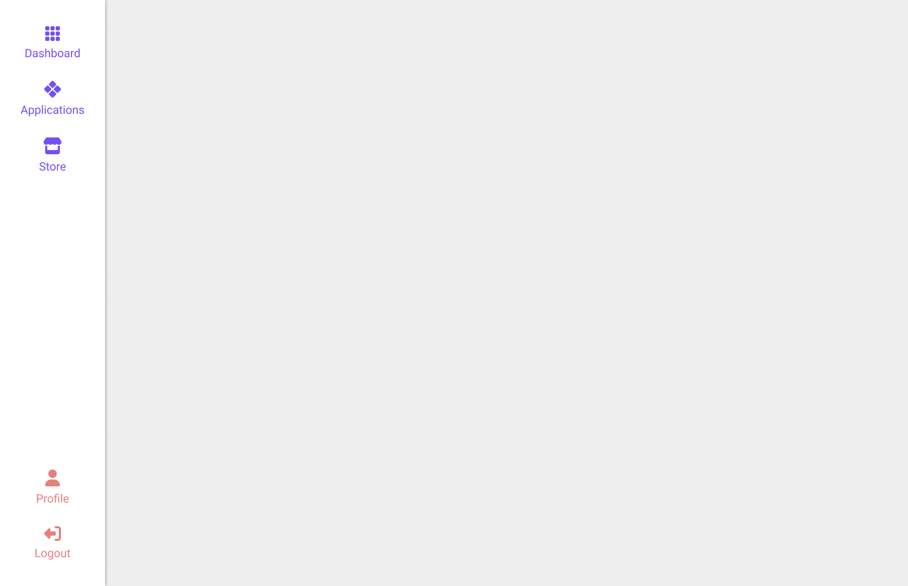

[](https://classroom.github.com/a/5K19tiVD)
# Exercice hebdomadaire 6

## Installation

1. Cloner le repository
2. Ouvrir le dossier avec Visual Studio Code
3. Ouvrir une fenêtre de terminal dans Visual Studio Code et entrer la commande suivante :

```bash
npm install
```

## Travail

Depuis le terminal, entrer la commande suivante :

```bash
npm run dev
```

## Consigne

1. Ouvrir [la maquette Figma](https://www.figma.com/design/fP8PTwlAYQz1U5rsGGv4ZG/imd-exercice-hebdomadaire-6?node-id=0-1&m=dev) dans l'équipe de votre année
2. Intégrer la maquette aussi précisément que possible, en reprenant les propriétés de Figma
3. Faire un commit, puis un push

## Aperçu de la maquette


